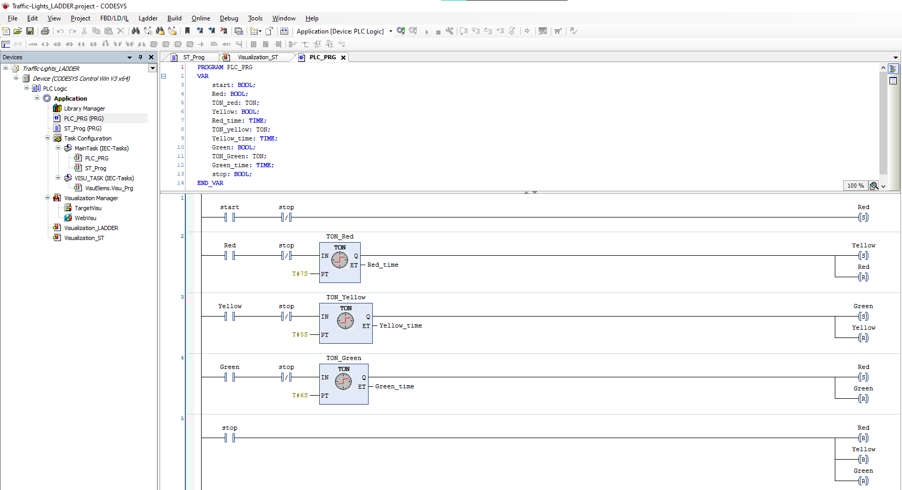

# Traffic Light Automation 🚦 – CODESYS Project 
This project simulates a basic traffic light system using Ladder Logic and Structured Text (ST) programming with CODESYS built- in visualization.

## Features :
- Red, Yellow, Green light sequence
- Custom timers for each stage
- Visualization interface with light indicators

## Tools Used :
- CODESYS 3.5
- Ladder Diagram (LD)
- Structured Text (ST)
- Built-in visualization editor

## Screenshots

